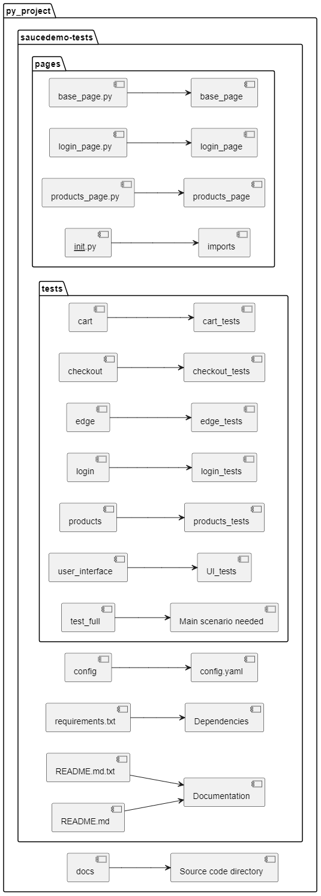
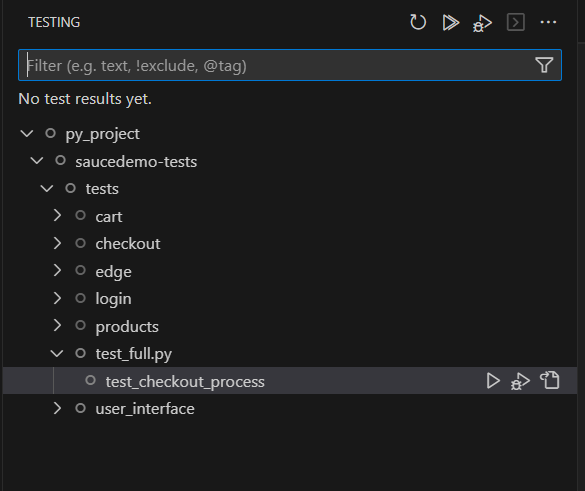
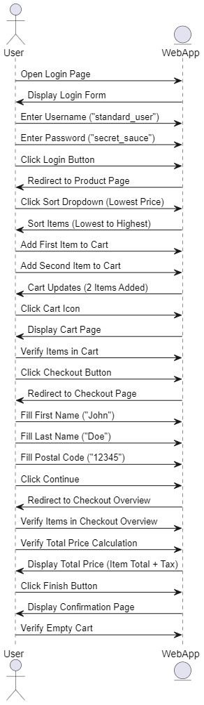
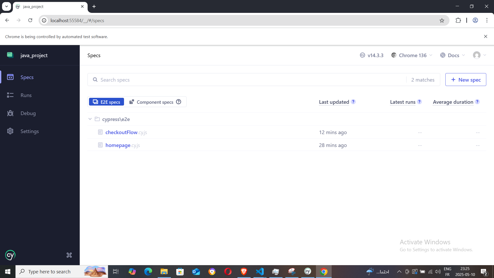

SauceDemo Automation Testing Project
This repository contains automated test scripts for the SauceDemo website. The project includes various test scenarios to validate the core functionality of the website, including the checkout process, login process, and product page interactions. The tests are written in Cypress, following best practices in automated testing, and are organized for easy execution and maintenance.

## 📁 Project Setup


## 🚀 Getting Started

### 1. Clone the Repository

```bash
git clone https://github.com/omar20ferchichi/m-c-cypress
cd your-repo-name
```
### 2. installations

```bash
npm install
npm install cypress --save-dev
```

### 3. Open Cypress Test Runner

```bash
npx cypress open
```

### 4. 🧪 Running Tests

To run all test cases:

choose e2e :



start e2e :



Landing: 



click on checkoutFlow



Execution 

<video src="java_project%20-%20Google%20Chrome%202025-05-10%2023-26-53-1.mp4" controls title="Title"></video>

