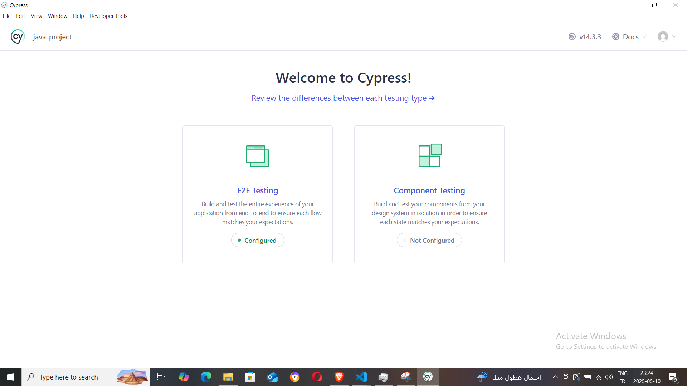
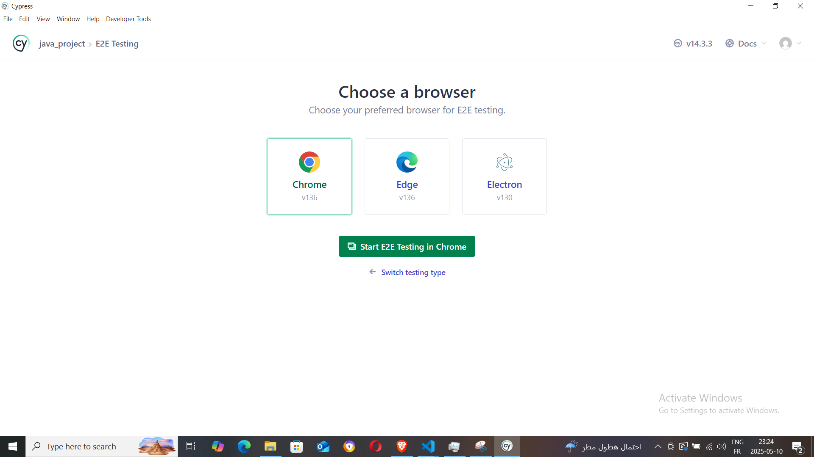
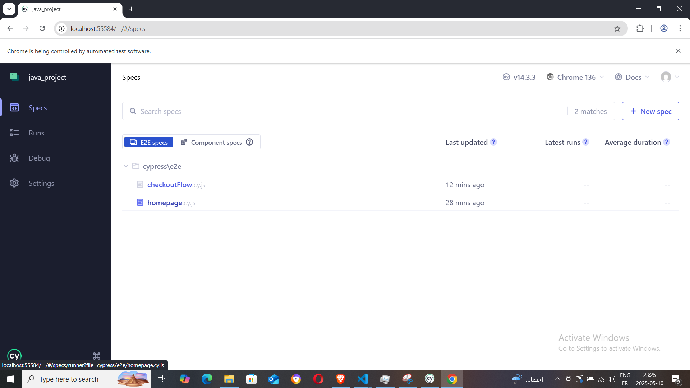

# Python Testing with Pytest

This project demonstrates how to write and run tests using the [`pytest`](https://docs.pytest.org/) framework in Python.

## 📁 Project Structure


## 🚀 Getting Started

### 1. Clone the Repository

```bash
git clone https://github.com/omar20ferchichi/m-c
cd your-repo-name
```
### 2. Create a Virtual Environment

```bash
python -m venv venv
source venv/bin/activate  # On Windows use `venv\Scripts\activate`
```

### 3. Install Dependencies

```bash
pip install -r requirements.txt
```

### 4. 🧪 Running Tests

To run all test cases:

```bash
pytest
```

To run tests with verbose output:

```bash
pytest -v
```

To run a specific test file:

```bash
pytest tests/login/test_login_valid_user.py
```


📊 Code Coverage (Optional):

```bash
pip install pytest-cov
pytest --cov=src
```

⚡ Parallel Test Execution (Optional):

```bash
pip install pytest-xdist
pytest -n auto
```



### Main test scenario 


